# Dependencias del Backlog — CFDI-AES

> Generado a partir del estado real de [GitHub Project #3](https://github.com/users/aciertoenti/projects/3) el 03 ago 2026 (`gh project item-list 3 --owner aciertoenti`). 32 tarjetas confirmadas: 7 Hecho, 1 En progreso, 1 Bloqueado, 23 Backlog. Ningún título fue inventado — todos provienen literalmente del Project.

Las 5 fases fueron definidas por el equipo (no son una columna del Project); cada tarea del board se clasificó en la fase donde mejor encaja. El microservicio de IA y el bloqueo de WhatsApp/Meta no encajan en ninguna de las 5 fases de facturación — se documentan como pistas aparte.

---

## Diagrama de dependencias

```mermaid
flowchart TD
    classDef hecho fill:#d4edda,stroke:#28a745,color:#155724
    classDef progreso fill:#fff3cd,stroke:#ffc107,color:#856404
    classDef bloqueado fill:#f8d7da,stroke:#dc3545,color:#721c24
    classDef backlog fill:#e2e3e5,stroke:#6c757d,color:#383d41
    F1 ==>|bloquea| F4
    F2 ==>|bloquea parcialmente| F4
    F4 -.->|habilita| F5
    F3 -.->|corre en paralelo, no bloquea| F1

    subgraph F1["Fase 1: Motor de CFDI"]
        direction TB
        T_csd["CSD de prueba Finkok configurado (Hecho)"]:::hecho
        T_finkok["Cliente real hacia sandbox Finkok (Hecho)"]:::hecho
        T_persist["Persistencia de facturas SQLAlchemy (Hecho)"]:::hecho
        T_xml["Generacion XML CFDI 4.0 + firma (En progreso)"]:::progreso
        T_rfcbackup["Registrar RFC EKU9003173C9 en Finkok - plan respaldo (Backlog)"]:::backlog
        T_csd --> T_finkok --> T_persist
        T_finkok -.->|si falla el registro automatico| T_rfcbackup
    end

    subgraph F2["Fase 2: Datos reales - fundacion"]
        direction TB
        T_cp["Validar CP 42501 contra catalogo SAT (Backlog)"]:::backlog
        T_regimen["Regimen fiscal y CP dinamico del emisor (Backlog)"]:::backlog
        T_adminpersist["Definir tarea: administracion persista emisores-clientes (Backlog)"]:::backlog
        T_folios["Folios consecutivos reales (Backlog)"]:::backlog
        T_clientesinc["Inconsistencia de datos falsos en Clientes (Backlog)"]:::backlog
        T_cp --> T_regimen
        T_adminpersist --> T_folios
        T_adminpersist --> T_clientesinc
    end

    subgraph F3["Fase 3: Seguridad e infraestructura"]
        direction TB
        T_jwt["Fix JWT_SECRET hardcodeado - fuga real (Hecho)"]:::hecho
        T_watoken["Fix token WhatsApp expuesto - fuga real (Hecho)"]:::hecho
        T_cleanup["Limpieza de repo README-roadmap (Hecho)"]:::hecho
        T_auditoria["Auditoria de secretos en todo el repo (Backlog)"]:::backlog
        T_auth["auth_usuarios validacion real (Backlog)"]:::backlog
        T_ambientes["Definir 3 ambientes Local-Staging-Produccion (Backlog)"]:::backlog
        T_envs["Configurar .env.staging y .env.production (Backlog)"]:::backlog
        T_cicd["Extender CI-CD para Staging y Produccion (Backlog)"]:::backlog
        T_ambientes --> T_envs --> T_cicd
    end

    subgraph F4["Fase 4: Cierre del flujo de facturacion"]
        direction TB
        T_mockreal["Facturas generadas y Reporte Mensual con datos reales (Hecho)"]:::hecho
        T_nuevafactura["Conectar formulario Nueva Factura al backend real (Backlog)"]:::backlog
        T_cancelacion["Cancelacion de CFDI (Backlog)"]:::backlog
        T_storage["Storage de XML-PDF en MinIO (Backlog)"]:::backlog
        T_costofinkok["Registrar costo real por factura timbrada (Backlog)"]:::backlog
        T_costowa["Registrar costo de conversacion de WhatsApp (Backlog)"]:::backlog
    end

    subgraph F5["Fase 5: Negocio y precios"]
        direction TB
        T_tenants["Disenar modelo de negocios-tenants (Backlog)"]:::backlog
        T_precios["Definir planes de precio (Backlog)"]:::backlog
        T_validarprecio["Validar precio con 3-5 negocios reales (Backlog)"]:::backlog
        T_dashboard["Dashboard de costos y margen (Backlog)"]:::backlog
    end

    subgraph IA["Fuera de fases: IA (no bloquea facturacion)"]
        direction TB
        T_iarescate["Rescate de microservicio IA desde el gateway (Hecho)"]:::hecho
        T_iaconectar["Conectar-activar microservicio IA (Backlog)"]:::backlog
        T_ticket["Facturacion asistida por ticket (Backlog)"]:::backlog
        T_iarescate --> T_iaconectar
    end

    EXT["BLOQUEO EXTERNO: Regenerar token WhatsApp en Meta (Bloqueado, 3-5 dias, en espera desde 31 jul 2026)"]:::bloqueado

    T_persist --> T_nuevafactura
    T_finkok --> T_nuevafactura
    T_finkok --> T_cancelacion
    T_persist --> T_cancelacion
    T_finkok --> T_costofinkok
    T_costofinkok --> T_dashboard
    T_costowa --> T_dashboard
    T_regimen <-.->|misma decision arquitectonica| T_tenants
    EXT -.->|bloquea| T_costowa
    EXT -.->|bloquea| T_ticket
```

**Cómo leer el diagrama**: las flechas gruesas (`==>`) son bloqueos duros entre fases completas. Las flechas finas dentro de cada `subgraph` son dependencias entre tareas puntuales, ya verificadas en los bodies de las tarjetas del Project. Las flechas punteadas (`-.->`) son relaciones más débiles: habilita/corre en paralelo/bloqueo externo.

---

## Fase 1 — Motor de CFDI

| Tarea | Estado | Bloquea / Desbloqueado por |
|---|---|---|
| Generación de XML CFDI 4.0 + cadena original + firma digital | **En progreso** | Bloquea casi todo Fase 4. Ya no depende de nada externo. |
| Cliente real hacia sandbox de Finkok | Hecho | Desbloqueó: Cancelación CFDI, Nueva Factura frontend, Registrar costo real Finkok. |
| Persistencia de facturas (SQLAlchemy) | Hecho | Desbloqueó parcialmente: Cancelación CFDI, Folios consecutivos (falta el otro bloqueador: administración). |
| Configuración de CSD de prueba Finkok (EKU9003173C9), validado extremo a extremo | Hecho | Prerrequisito técnico del cliente Finkok. |
| Registrar RFC de prueba EKU9003173C9 en panel de Finkok | Backlog | Ya no bloquea nada — quedó como plan de respaldo manual si el registro automático falla. |

## Fase 2 — Datos reales (fundación)

| Tarea | Estado | Bloquea / Desbloqueado por |
|---|---|---|
| Validar el CP de prueba (42501) contra el catálogo oficial c_CodigoPostal del SAT | Backlog | Bloquea: régimen fiscal y CP dinámico (hacerlo antes evita retrabajo). |
| Resolver de dónde sale el régimen fiscal y CP del emisor de forma dinámica | Backlog | Depende de: validar CP. Acoplada a: modelo de negocios/tenants (misma decisión arquitectónica). |
| Definir tarea propia para que administración persista emisores/clientes reales | Backlog | Dependencia oculta — bloquea: folios consecutivos, inconsistencia de "Clientes". Hoy `administracion` es un stub sin persistencia. |
| Folios consecutivos reales (conectar con administracion) | Backlog | Depende de: persistencia de facturas (Hecho) + administración persista emisores (pendiente). |
| Resolver inconsistencia de datos falsos en "Clientes" del frontend | Backlog | Depende de: administración persista emisores/clientes reales. |

## Fase 3 — Seguridad e infraestructura (paralelo, urgente)

| Tarea | Estado | Bloquea / Desbloqueado por |
|---|---|---|
| Corrección JWT_SECRET (gateway + auth) | Hecho | Cerró la primera fuga real de secretos. |
| Fix: token real de WhatsApp expuesto en .env.example + corrección de .gitignore | Hecho | Cerró la segunda fuga real de secretos. |
| Limpieza de repo (README encoding, roadmap duplicado) | Hecho | Sin dependencias. |
| Auditoría de secretos: revisar todo el repo en busca de credenciales reales | Backlog | Sin dependencias — justificada por las 2 fugas reales ya encontradas. |
| auth_usuarios: validación real contra base de datos | Backlog | Sin dependencias. Independiente del flujo de facturación. |
| Definir y documentar los 3 ambientes (Local/Staging/Producción) | Backlog | Bloquea: .env.staging/.env.production. |
| Configurar .env.staging y .env.production separados | Backlog | Depende de: definición de los 3 ambientes. Bloquea: CI/CD. |
| Extender el pipeline de CI/CD para Staging/Producción | Backlog | Depende de: .env.staging/.env.production. |

## Fase 4 — Cierre del flujo de facturación (depende de Fase 1 y Fase 2)

| Tarea | Estado | Bloquea / Desbloqueado por |
|---|---|---|
| Reemplazar datos mock de "Facturas generadas" y "Reporte Mensual" por datos reales | Hecho | Desbloqueada por: persistencia de facturas. |
| Conectar formulario "Nueva Factura" del frontend al backend real | Backlog | Desbloqueada por: cliente Finkok (Hecho). Sin bloqueador. |
| Cancelación de CFDI | Backlog | Desbloqueada por: cliente Finkok + persistencia (ambos Hecho). Sin bloqueador. |
| Storage de XML/PDF (MinIO) | Backlog | Sin dependencias estrictas — puede hacerse en paralelo. |
| Registrar costo real por factura timbrada (Finkok) | Backlog | Desbloqueada por: cliente Finkok (Hecho). Bloquea: Dashboard de costos. |
| Registrar costo de conversación de WhatsApp por interacción del bot | Backlog | **Bloqueada externamente** por la regeneración del token de WhatsApp en Meta. Bloquea: Dashboard de costos. |

## Fase 5 — Negocio y precios (depende parcialmente de Fase 4)

| Tarea | Estado | Bloquea / Desbloqueado por |
|---|---|---|
| Diseñar modelo de negocios/tenants | Backlog | Acoplada a: régimen fiscal y CP dinámico (Fase 2) — misma decisión arquitectónica, resolver juntas. |
| Definir y documentar los planes de precio | Backlog | Sin dependencias — actividad de negocio, no requiere código. |
| Validar precio con 3-5 negocios reales | Backlog | Sin dependencias — corre en paralelo a todo lo técnico. |
| Dashboard de costos y margen por negocio | Backlog | Depende de: "Registrar costo real Finkok" y "Registrar costo de conversación WhatsApp" (ambas en Fase 4). |

## Fuera de las 5 fases

| Tarea | Estado | Nota |
|---|---|---|
| Rescate de microservicio de IA desde el gateway | Hecho | Recuperó código que se iba a perder al reescribir el gateway. |
| Conectar/activar el microservicio de IA rescatado | Backlog | Depende de: resolver conflicto de puerto 8006 + agregar Dockerfile/docker-compose. Rama separada del flujo de facturación. |
| Explorar "Facturación asistida por ticket" | Backlog | Iniciativa Fase 3-4 de producto (a verificar con negocio si sigue vigente). **Bloqueada externamente** por el token de WhatsApp. |

## Bloqueo externo

| Tarea | Estado | Impacto |
|---|---|---|
| Regenerar token de WhatsApp en Meta | **Bloqueado** (3-5 días, en espera desde 31 jul 2026) | Bloquea: "Registrar costo de conversación de WhatsApp" y "Facturación asistida por ticket". Sin ETA controlable por el equipo — depende de Meta/Microsoft. |

---

## Próximos pasos recomendados

1. **Dispara ya el trámite del token de WhatsApp en Meta** — es el único ítem con una demora externa de días que no se puede acelerar trabajando más rápido. Cuanto antes se dispare, antes deja de bloquear Fase 4/5.
2. **Termina el motor de CFDI en progreso** (Fase 1) — es lo único que todavía bloquea directamente Fase 4 completa.
3. **En paralelo**, arranca Fase 3 (seguridad e infraestructura) — no depende de nada y ya hay evidencia concreta (2 fugas reales) de que vale la pena priorizarla, no dejarla para el final.
4. **Resuelve la dependencia oculta de Fase 2** ("administración persista emisores/clientes reales") pronto — desbloquea 2 tareas (folios, inconsistencia de Clientes) que de otra forma quedan varadas indefinidamente.
5. **Cierra Fase 4** con lo que ya no tiene bloqueador: Nueva Factura frontend y Cancelación de CFDI pueden atacarse de inmediato, sin esperar nada más.
6. **Fase 5 (negocio) puede avanzar en paralelo desde ya** en su mitad no técnica (planes de precio, validación con negocios reales) — no tiene por qué esperar a que el resto termine.
7. Deja el Dashboard de costos y la iniciativa de IA para el final — ambos dependen de trabajo de fases anteriores que todavía no está listo.
